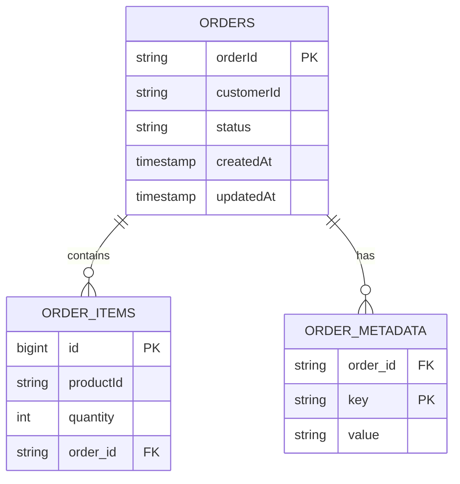
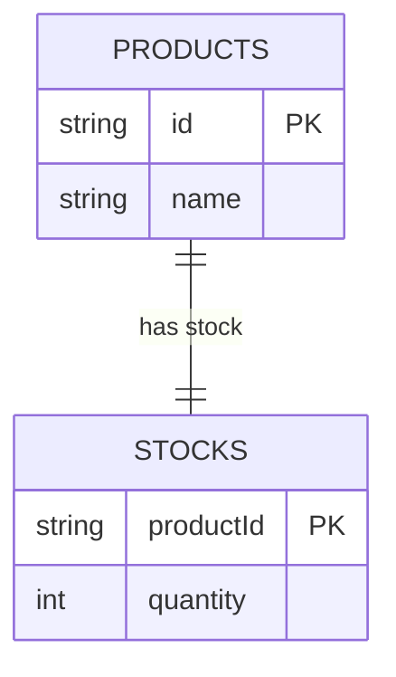
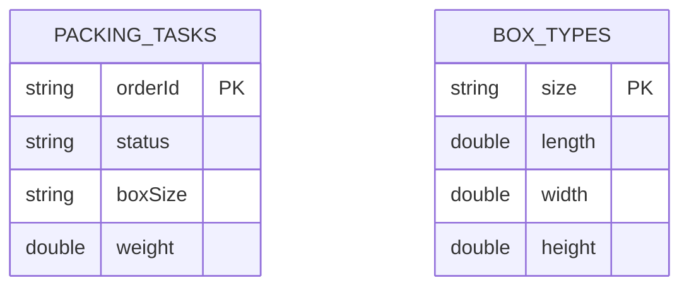
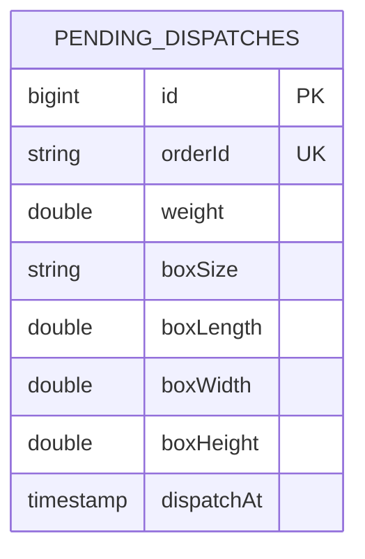
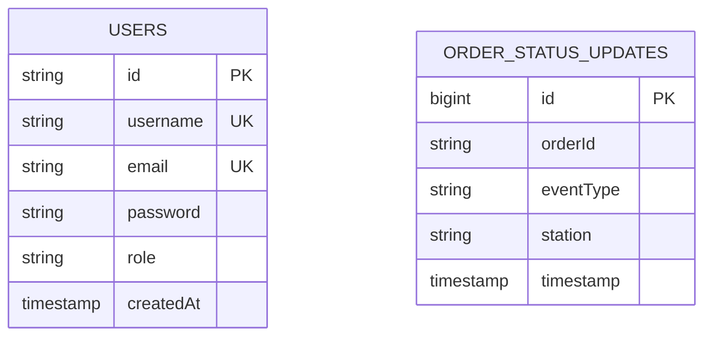

# Sprawozdanie projektowe — System zarządzania magazynem (Outbound System)

---
## 1. Słowny opis tematu i problemy do rozwiązania

Projekt to system wspierający procesy magazynowe (rezerwacja zapasów, kompletacja, pakowanie, wysyłka) realizowany w architekturze mikroserwisów z komunikacją asynchroniczną. Zamówienie przepływa przez kolejne domeny jako zdarzenie publikowane na RabbitMQ; po stronie klienckiej dostarczany jest spójny panel operatorski agregujący dane z wielu niezależnych serwisów.

**Problemy do rozwiązania w ramach implementacji:**

1. **Koordynacja procesu między kilkoma niezależnymi domenami** bez bezpośrednich wywołań HTTP między serwisami biznesowymi — rozwiązana łańcuchem zdarzeń domenowych publikowanych i konsumowanych przez RabbitMQ (każdy serwis reaguje na zdarzenie poprzednika i publikuje własne).
2. **Odpowiednia persystencja** — różne profile użycia wymagają różnych baz: dane transakcyjne (zamówienia, rezerwacje, użytkownicy) trzymane są w PostgreSQL, a typowe  dokumenty głównie do oczytu zadań pickingu oraz archiwum wysyłek — w DynamoDB.
3. **Agregacja danych z wielu serwisów na rzecz frontendu** — rozwiązana wzorcem **Backend For Frontend (BFF)**, który stanowi jedyny punkt wejścia dla aplikacji klienckiej i ukrywa przed nią topologię backendu.
4. **Aktualizacja stanu zamówienia w widoku klienta w czasie rzeczywistym** — rozwiązana mechanizmem **Server-Sent Events (SSE)**: BFF konsumuje zdarzenia z RabbitMQ i przekazuje je strumieniowo do przeglądarki.

---
## 2. Zakres funkcjonalny systemu

System rozróżnia trzy role użytkowników: `USER` (klient), `OPERATOR` (pracownik magazynu), `ADMIN` (administrator).

### Klient (`USER`)
- Złożenie zamówienia poprzez formularz (wybór produktów z katalogu + ilości).
- Przegląd własnych zamówień z filtrowaniem po statusie i wyszukiwaniem po ID.
- Podgląd szczegółów zamówienia: lista pozycji, oś czasu zmian statusów aktualizowana na żywo (SSE) oraz dane wysyłki po jej utworzeniu (numer śledzenia, koszt, data nadania).

### Operator (`OPERATOR`)
- Przegląd wszystkich zamówień z możliwością podglądu szczegółów.
- Ekran pickingu — lista zadań kompletacji.
- Ekran pakowania — finalizacja zadania pakowania z przypisaniem typu pudełka i wagi.
- Stany magazynowe — przegląd dostępności produktów.

### Administrator (`ADMIN`)
- Wszystkie powyższe ekrany + panel administracyjny do zarządzania użytkownikami i rolami.

### Funkcjonalności przekrojowe
- **Rejestracja i logowanie**.
- **Dashboard** — kafelki ze zliczeniem zamówień w każdym statusie oraz wykres.
- **Autoryzacja z rolami**.
- **Odporność na awarie** — Circuit Breaker dla wywołań z BFF do serwisów domenowych.

---
## 3. Repozytorium kodu

- **GitHub**
- **Struktura monorepo** (Gradle multi-module):
  ```
  outbound-system/
  ├── common/                    # wspólne typy, eventy, konfiguracje np. RabbitMQ, mediator
  ├── order-gateway-service/     # przyjmowanie zamówień
  ├── reservation-service/       # rezerwacja zapasów
  ├── picking-service/           # kompletacja
  ├── packing-service/           # pakowanie
  ├── shipping-service/          # wysyłka
  ├── bff-service/               # Backend For Frontend
  ├── frontend/                  # Angular SPA
  ├── docker-compose.yml         # produkcyjny stack
  ├── docker-compose.dev.yml     # stack z infrastrukturą do uruchomienia lokalnego
  └── init-dbs.sql               # inicjalizacja baz PostgreSQL
  ```

Rolę środowiska uruchomieniowego pełni **Docker Compose** (`docker-compose.yml`, `docker-compose.dev.yml`), który startuje pełny stos infrastruktury (PostgreSQL, RabbitMQ, DynamoDB) wraz z wszystkimi serwisami.

---
## 4. Opis i diagramy projektowanego systemu

### 4.1. Diagram procesu fulfillmentu zamówienia (BPMN)


### 4.2. Zdarzenia domenowe

| Zdarzenie                     | Publikuje              | 
| ----------------------------- | ---------------------- |
| `OrderCreatedEvent`   | order-gateway-service  |
| `StockReservedEvent`          | reservation-service    |
| `AllocationFailedEvent`       | reservation-service    |
| `OrderPickedEvent`            | picking-service        | 
| `OrderPickFailedEvent`        | picking-service        |
| `PackingFinishedEvent`        | packing-service        | 
| `ShipmentCreatedEvent`        | shipping-service       | 

---
## 5. Spis ekranów wraz z makietami

| # | Ekran    | Dostęp                  | Opis funkcjonalny                                                                      |
|---|---------------------------------|----------------------|----------------------------------------------------------------------------------------|
| 1 | Logowanie                        | publiczny               | Formularz logowania, otrzymanie tokena JWT.                                            |
| 2 | Rejestracja                           | publiczny               | Formularz rejestracji nowego konta klienta.                                            |
| 3 | Dashboard                             | zalogowany              | Statystyki ogólne, wykresy słupkowe.     |
| 4 | Lista zamówień                            | zalogowany              | Tabela z filtrami; klient widzi tylko swoje zamówienia, operator/admin — wszystkie.    |
| 5 | Tworzenie zamówienia                   | `USER`                  | Formularz wyboru pozycji zamówienia (produkt z katalogu + ilość).                       |
| 6 | Szczegóły zamówienia                   | zalogowany              | Pozycje + oś czasu statusów (SSE live) + atrybuty wysyłki (`trackingNumber`).      |
| 7 | Picking                                    | `OPERATOR`, `ADMIN`     | Lista zadań kompletacji, oznaczanie postępu zbierania pozycji.                         |
| 8 | Packing                                   | `OPERATOR`, `ADMIN`     | Lista zadań pakowania, przypisanie pudełka i wagi.                         |
| 9 | Stany magazynowe                            | `OPERATOR`, `ADMIN`     | Lista produktów i ich dostępności w magazynie.                                         |
|10 | Panel administracyjny                     | `ADMIN`                 | Zarządzanie użytkownikami i rolami.                                                    |
### 5.1. Mockupy


---
## 6. Wybór i opis architektury aplikacji

### 6.1. Architektura backendu — mikroserwisy event-driven z warstwą BFF

System zaprojektowany będzie jako zbiór **niezależnych mikroserwisów**, każdy z własną bazą danych (wzorzec *Database per Service*) i odpowiedzialnością ograniczoną do jednej domeny biznesowej. Komunikacja między serwisami domenowymi realizowana jest **wyłącznie asynchronicznie** przez RabbitMQ — żaden serwis biznesowy nie wywołuje innego po HTTP.

**Wzorce zastosowane:**
- **Backend For Frontend (BFF)** — pojedynczy serwis stanowiący API dla aplikacji klienckiej. Komunikuje się z domenami synchronicznie przez **FeignClient** (REST), zabezpieczony **Circuit Breakerem**.
- **Command/Query Separation (CQS)** — każdy controller w serwisach domenowych deleguje obsługę żądania przez `mediator.send(...)` do odpowiedniego handlera, oddzielając zapisy od odczytów.
- **DDD** — `api/`, `application/`, `domain/`, `infrastructure/` w każdym serwisie.
- **Server-Sent Events (SSE)** — BFF strumieniuje zdarzenia do przeglądarki. Wybrano SSE zamiast WebSocket, ponieważ ruch jest jednokierunkowy (serwer → klient).

**Uzasadnienie wyboru:**
- Niezależne skalowanie wąskich gardeł i niezależny rozwój każdej domeny.
- Padnięcie pojedynczego serwisu nie blokuje pozostałych — zdarzenia kolejkowane w RabbitMQ.
- Każdy serwis dobiera bazę odpowiednią do profilu danych (np. PostgreSQL dla transakcji, DynamoDB dla zadań i archiwum).
- Jasne granice odpowiedzialności biznesowej — granice domen pokrywają się z granicami serwisów.
### 6.2. Architektura frontendu — **SPA komponentowa (Angular standalone components)**

Aplikacja kliencka to **Single Page Application** w Angularze 21 wykorzystująca *standalone components*, z **lazy loadingiem** na poziomie ścieżek (każdy ekran ładowany dynamicznie przez `loadComponent`).

**Warstwy:**
- `core/` — guardy (`authGuard`, `roleGuard`), interceptory HTTP, serwisy bazowe.
- `pages/` — komponenty-ekrany (login, dashboard, orders, picking, packing, …).
- `shared/` — komponenty wielokrotnego użytku.
- Routing oparty o `app.routes.ts` z guardami autoryzacyjnymi.

---
## 7. Schemat bazy danych

System wykorzystuje **wzorzec Database per Service**: każdy mikroserwis ma własną bazę i schemat, niewidoczny dla pozostałych. Dwie technologie persystencji:
- **PostgreSQL** (5 baz: `orderdb`, `reservationdb`, `packingdb`, `shippingdb`, `bffdb`).
- **DynamoDB** (2 tabele: `picking_tasks`, `shipments`).
### 7.1. Diagramy ERD (PostgreSQL — bazy per serwis)

#### `orderdb` — order-gateway-service


#### `reservationdb` — reservation-service


#### `packingdb` — packing-service


#### `shippingdb` — shipping-service


#### `bffdb` — bff-service


---
## 8. Propozycja stosu technologicznego

### 8.1. Backend (Java)
Java, Spring Boot, Spring, PostgreSQL, DynamoDB, RabbitMQ, JJWT                                       
### 8.2. Frontend
Angular, TypeScript, TailwindCSS, Chart.js

---
## 9. Podsumowanie

Zaprezentowany system pokrywa kompletny przepływ obsługi zamówienia wychodzącego z magazynu — od jego złożenia przez klienta, przez rezerwację zapasów, kompletację, pakowanie, aż po wysyłkę — z pełną wizualizacją tego procesu w panelu operatorskim w czasie rzeczywistym. Wybrana architektura mikroserwisowa z choreograficzną sagą i wzorcem BFF umożliwia niezależną ewolucję i skalowanie każdej z domen, a zastosowane wzorce odpornościowe (Circuit Breaker, asynchroniczne kolejki) zapewniają stabilność całości w warunkach częściowych awarii.